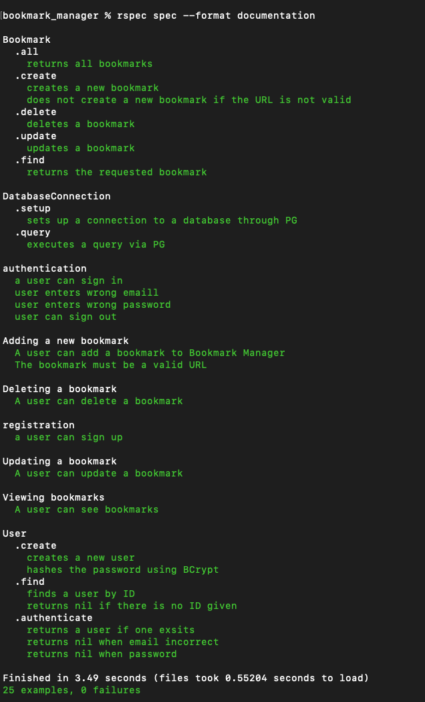

# Bookmark manager

This is the week 4 Makers challenge which is to build a bookmark manager with a PSQL backend and an HTML front end. The model and controller are built in Ruby.

This program allows the user to create, read, update and delete bookmarks. Additionally, users can sign up, sign in and sign out. Password are stored safely using BCrypt.

## User Stories

The following user stories were implemented as part of this project:

```
As a time-pressed user
So that I can quickly go to web sites I regularly visit
I would like to see a list of bookmarks

As a user
So I can store bookmark data for later retrieval
I want to add a bookmark to Bookmark Manager

As a user
So that I can keep my bookmarks relevant
I want to delete a bookmark

As a user
So that I can keep my bookmarks up to date
I want to edit a bookmark

As a user
So that the bookmarks I save are useful
I want to only save a valid URL

As a user
So that I can have a personalised bookmark list
I want to sign up with my email address

As a user
So that I can keep my account secure
I want to sign in with my email and password

As a user
So that I can keep my account secure
I want to sign out
```

## How to use

### To set up the project

Clone this repository, navigate to the directory in the command line and then run:

```
bundle install
```

### To set up the database

Connect to `psql` and create the `bookmark_manager` and `bookmark_manager_test` databases:

```
CREATE DATABASE bookmark_manager;
CREATE DATABASE bookmark_manager_test;
```

To set up the appropriate tables, connect to each database in `psql` and run the SQL scripts in the `db/migrations` folder in the given order.

### To run the Bookmark Manager app:

Navigate to the program directory and from the command line run:

```
rackup 
```

To view bookmarks, navigate to `localhost:9292/bookmarks` in your web browser.

### Testing:

All testing was done using RSpec, to run the test suite type the following in the command line:

```
rspec
```

The test output is shown below:

